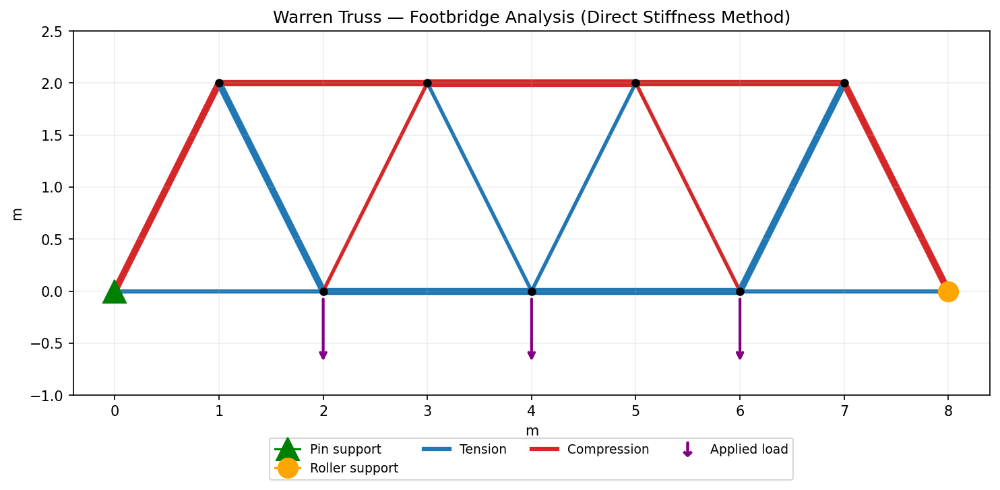

# Truss Structural Analysis Solver

A 2D pin-jointed truss solver built from the direct stiffness method — the same underlying approach real structural analysis and FEA software uses, simplified to axial-only (pin-jointed) members. Given a truss's geometry, supports, and loads, it computes nodal displacements, support reactions, and the axial force (tension/compression) in every member.



## Why this exists

This is a genuine, checkable engineering calculation, not a simulation of made-up physics — the kind of tool used (in a much more developed form) to design real bridges and roof trusses. I wanted to implement the method myself rather than just use a package, and prove it's correct against a problem I could solve by hand.

## The method

1. Build each member's 4×4 stiffness matrix from its length and orientation.
2. Assemble every member's contribution into one global stiffness matrix `K`.
3. Partition `K` into free/fixed degrees of freedom, solve `K_ff @ u_f = F_f` for the unknown displacements.
4. Recover support reactions from the full equilibrium equation.
5. Convert each member's end displacements into an axial force via `(EA/L) × elongation`.

## Verified against a hand calculation

The core correctness check (`tests/test_truss.py`) solves a simple, statically determinate 3-bar truss — a pin support, a roller support, and an apex load — and checks the solver's output against the **exact values from the method of joints**, worked by hand:

| Member | Hand calculation | Solver output |
|---|---|---|
| AB (base, tension) | +0.375·P | matches to 1e-6 |
| AC (diagonal, compression) | −0.625·P | matches to 1e-6 |
| BC (diagonal, compression) | −0.625·P | matches to 1e-6 |

This is also run with two different steel/aluminium stiffness values to confirm a real structural-engineering property: **member forces in a statically determinate truss don't depend on material stiffness** — only geometry and loads matter. Two more tests check global equilibrium (reactions + loads sum to zero) and that a member pulled apart correctly registers as tension, not compression.

pytest tests/ -v

4 passed

## Worked example: a footbridge truss

`main.py` analyses a 9-node, 15-member Warren truss (an 8m span, 2m deep — a standard footbridge/roof layout) under three point loads representing deck traffic, and produces the diagram above plus a force table:

python main.py --out warren_truss.png


The result matches what you'd expect physically, which is itself a useful sanity check: the bottom chord is entirely in **tension** and the top chord entirely in **compression** (exactly as in simple beam bending), the diagonals alternate, and the structure is symmetric because the loading is symmetric — reactions split 18 kN / 18 kN for a 36 kN total load.

## Usage

```bash
pip install -r requirements.txt
python main.py --out my_truss.png
pytest tests/ -v
```

To analyse your own truss, define `nodes` (coordinates), `members` (which nodes connect, plus `E` and `A`), `supports` (which DOFs are fixed per node), and `loads` (force per node), then call `solve_truss(nodes, members, supports, loads)`.

## Limitations / what I'd extend next

- Pin-jointed (axial-only) members only — no bending moments, so this can't analyse frames, just trusses
- Assumes small deformations (linear stiffness) — fine for this kind of analysis, not for large-deflection problems
- No automatic statical-determinacy check (`m + r = 2n`) before solving — an under-braced structure currently just fails with a singular-matrix error rather than a clear message
- Next step: add a determinacy check with a helpful error message, and support prescribed non-zero displacements (e.g. support settlement)
